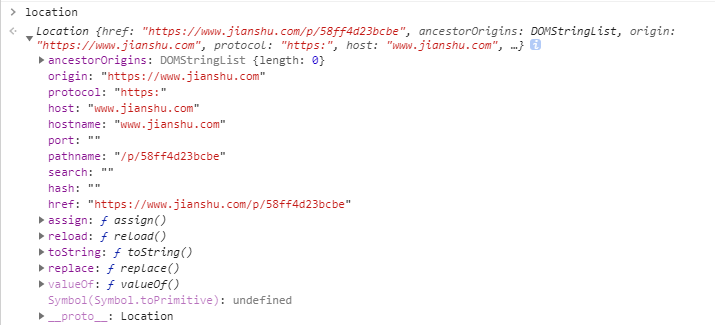
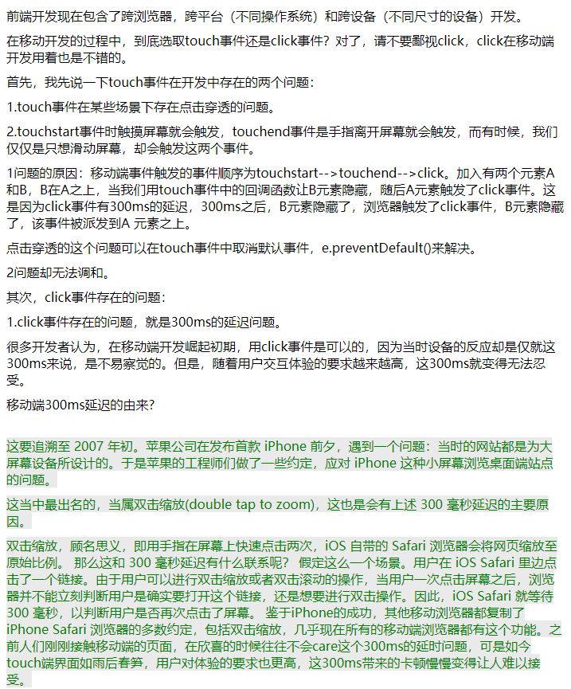
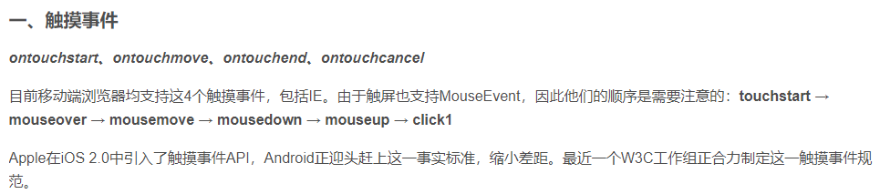
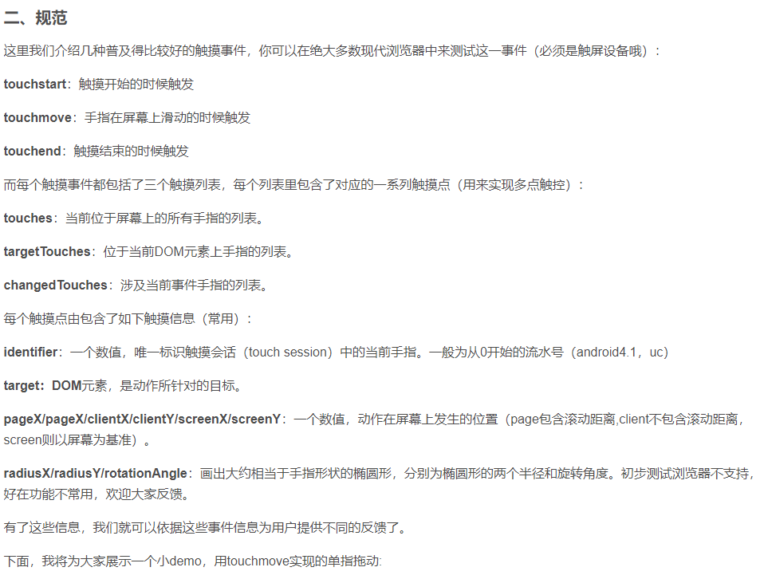
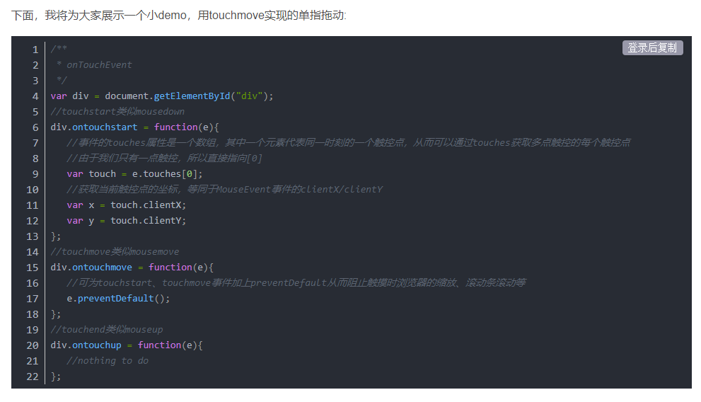

## 1. WebView控件

Android应用层开发的方向有两种：客户端开发和HTML5移动端开发。HTML5开发就是：HTML5 + CSS + JS来构建 一个网页版的应用, 而这中间的媒介就是这个WebView。WebView和网页端可以通过JS来进行交互, 比如,网页读取手机联系人,调用手机相关的API等！

### 1.1 什么是WebView

Android内置webkit内核的高性能浏览器,而WebView则是在这个基础上进行封装后的一个 控件,WebView直译网页视图,我们可以简单的看作一个可以嵌套到界面上的一个浏览器控件. WebView通过 loadUrl 这个API加载 html 文件，如果是加载本地文件直接使用 file://协议【注：在hatom中线上编译后就是将前端资源作为本地静态文件来进行访问】，也可以加载网络资源。

## 2. 需要注意的问题

移动端H5开发, 采用了 WebView 这个中间件，和真实的浏览器环境还是有很多不一样的，因此会存在很多大大小小的坑，稍不注意就踩进去了。

### 2.1 window.location

浏览器中通常会使用 window.location 来获取网页当前的url, 协议，主机名等内容



在webview中，使用 file:// 加载前端资源是，是不能正常使用window.location的。

### 2.2 window.localStorage

ios系统上使用localStorage不会生效，原因是ios上 WebView 是独占进程的，每个WebView都是新的进程，也就是每个WebView都有自己的localstorage, 相互之间不会共享。解决方法就是使用 hatom.storage.setItem 写入手机缓存中。参考：

https://hatom2.hikyun.com/doc/h5-developer/api/storage.html

### 2.3 移动端click和touch事件的区别








## 3. 常用的工具函数

### 3.1 判断当前的设备类型

移动端常用的ios系统和安卓操作系统，在两种机型上经常会有一些适配性问题。因此判断当前的设备类型这种操作就比较常见

```javascript

let ua = window.navigator.userAgent,
    app = window.navigator.appVersion;
alert('浏览器版本: ' + app + '\n' + '用户代理: ' + ua);
if(!!ua.match(/\(i[^;]+;( U;)? CPU.+Mac OS X/)){
    // ios端 
    console.log('ios端');
}
else if(ua.indexOf('Android') > -1 || ua.indexOf('Adr') > -1) {
    // android端 
    console.log('android端');
}
if (ua.match(/MicroMessenger/i) == 'MicroMessenger') {
    // 微信浏览器 
    console.log('微信浏览器');
}

```

## 4. hatom移动应用开发

### 4.1 setBridge\native

hatom.setBridge: 向原生端注册一个方法，供原生端调用。注意这个通常是向原生端钩子函数注册一个回调方法；

hatom.native:  当APP新开了一个自定义的接口，H5端需要采用native方法去调用原生APP自定义的方法

## 5. IOS 

### 5.1 IOS描述文件
    
    使用iOS描述文件可以参与接收Public beta（公开测试版）、开发者预览版。iOS描述文件（profile）其实是系统中的设置文 件，实质上是一个XML文件，借助描述文件可以将已经设置和授权过的信息载入到苹果设备中（iPhone、iPad、iPod touch、  Apple TV和Mac电脑）。设置和授权信息包含：设备安全性策略和访问限制、专用网络配置、Wi-Fi设置、邮件和日历帐户等。包含以下内容：设备的安全策略和限制、** 配置信息、无线局域网设置、电子邮件帐户和日历帐户以及可允许 iPhone、iPod touch 和 iPad 配合您的企业系统使用的鉴定凭证。
    
 hatom平台上将ios描述文件上传就可以生成证书，利用证书就可以重新进行签名。申请一台测试手机，需要添加开发者账号才能安装非应用商店的应用，这个开发者账号与描述文件是有关联关系的，描述文件和开发者账号相互对应，才能在这台手机上安装测试应用。
 
 
 
 
 
 ### 5.2 ios拨号助手对移动172号码段的判断错误
 
 
 
 